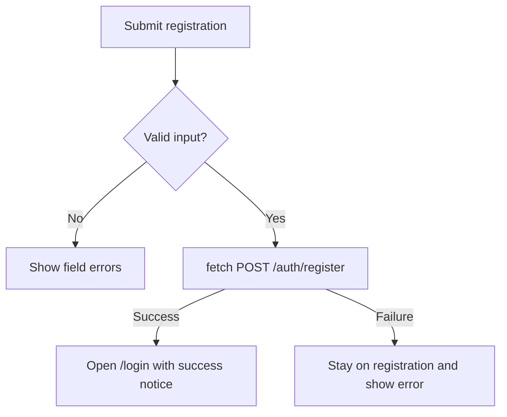
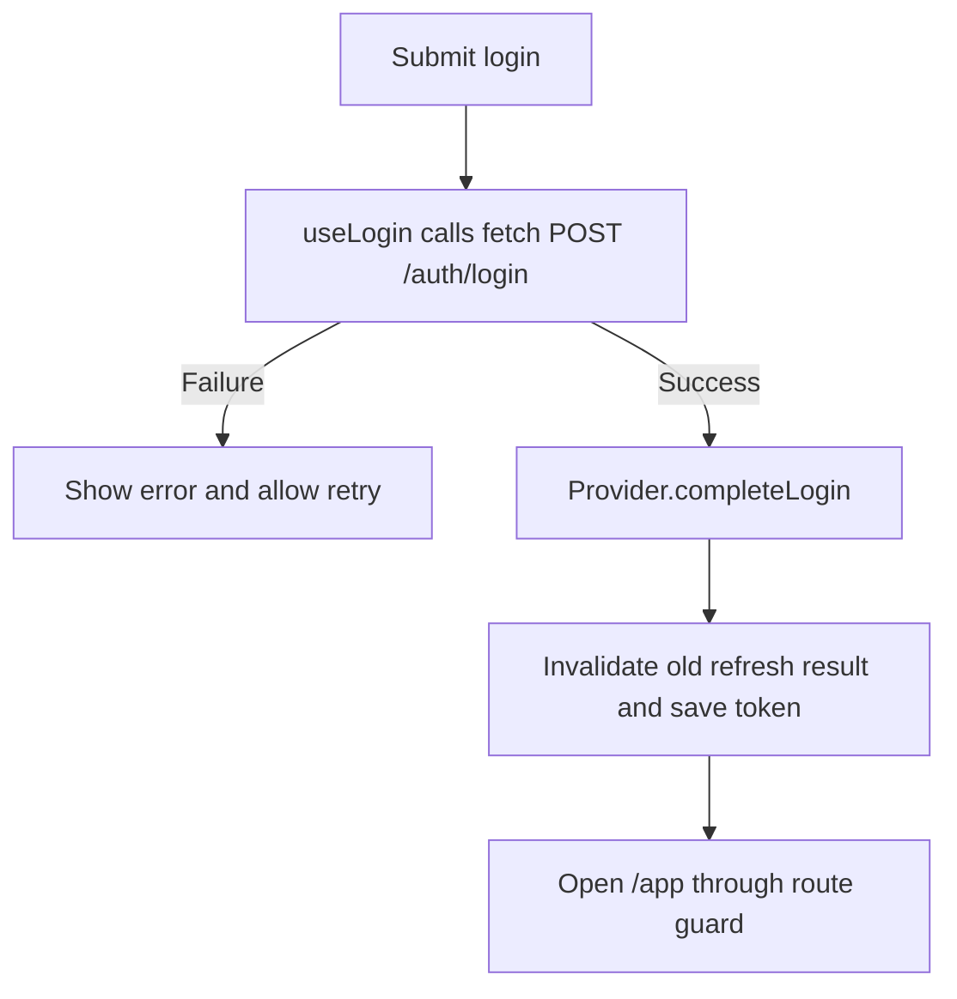
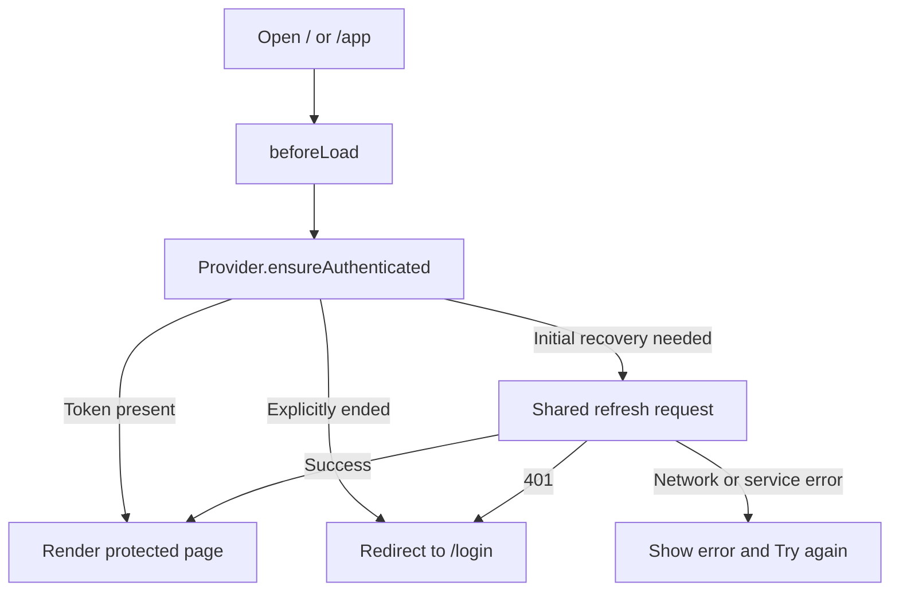
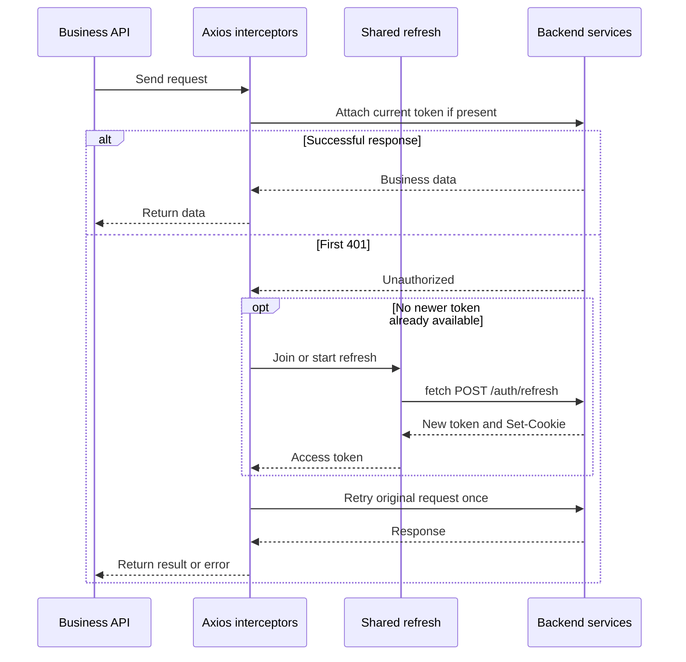
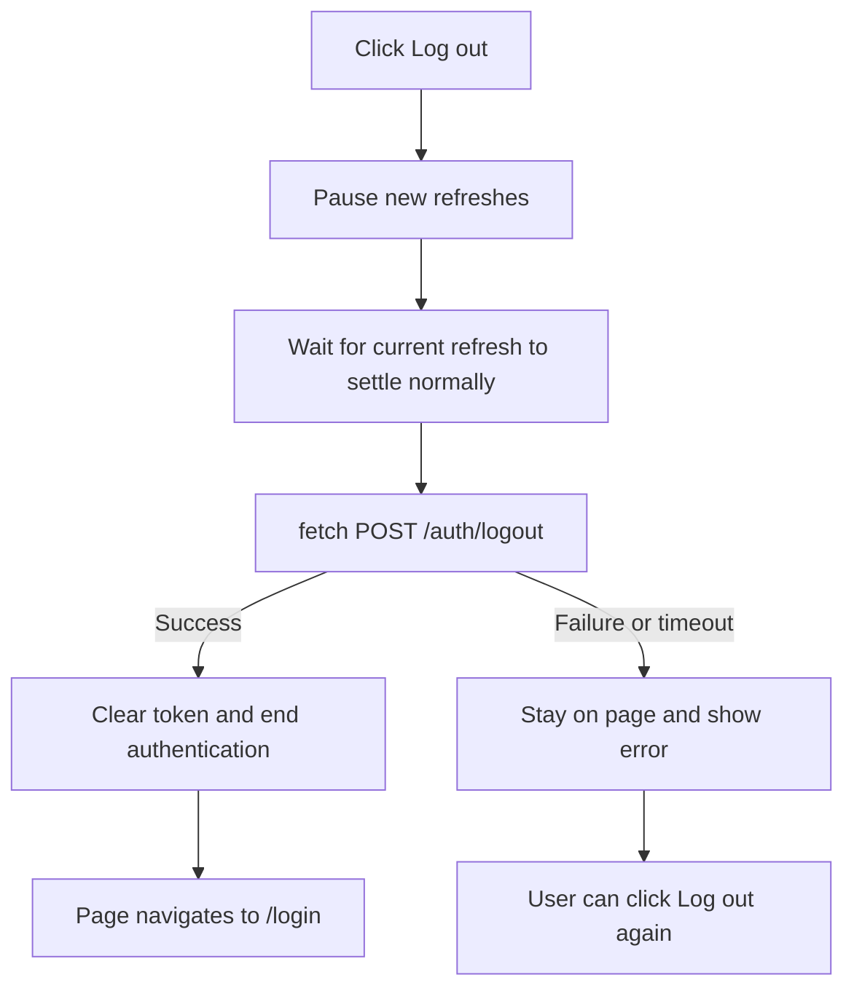

# Authentication Flow

## 1. Architecture Overview

There is one in-memory access token. AuthProvider supplies React authentication
operations, while Router decides whether a protected page can load. Auth HTTP
requests use fetch and business HTTP requests use the shared Axios client.

```mermaid
flowchart TB
    subgraph Routes[Protected route admission]
        direction LR
        Guard[beforeLoad] --> Provider[AuthProvider operations]
        Provider --> Token[Read token or restore once]
    end
    subgraph Auth[Form submissions]
        direction LR
        Page[Page and mutation hook] --> Fetch[Auth API via fetch]
        Fetch --> User[User Service]
    end
    subgraph Business[Business requests]
        direction LR
        API[Business API] --> Axios[Axios interceptors]
        Axios --> Service[Backend service]
    end
```

| Part                 | Responsibility                                                                                                   |
| -------------------- | ---------------------------------------------------------------------------------------------------------------- |
| `accessTokenStore`   | Keep the single access token in memory.                                                                          |
| `refreshAccessToken` | Share a refresh request, save its token, and discard obsolete results.                                           |
| `AuthProvider`       | Complete login, restore authentication, coordinate logout, and notify React of confirmed authentication failure. |
| Router               | Use Provider operations through Router context to decide protected route access.                                 |
| Axios interceptors   | Attach the token, recover from a first 401, and retry once.                                                      |
| Backend              | Issue access tokens and manage HttpOnly refresh cookies and token rotation.                                      |

Provider does not keep another token or `isLoggedIn` value. Its explicit-ended
flag distinguishes a fresh page that may restore authentication from a page
where successful logout or confirmed authentication failure has occurred. Pending recovery
and its error display belong to the route, not a global auth status enum.

## 2. Registration and Login

### Registration

The form normalizes names and emails while preserving password characters.
The API receives only name, email, and password. Registration creates an
account, not an authenticated frontend session.

### Login

The browser processes the refresh cookie from the login response. Provider saves
the access token and allows recovery again. Existing form validation, submission
locks, and pending feedback remain in the page and hook.

## 3. Session Recovery and Route Protection

A browser reload clears the memory token. It is different from a token refresh,
which calls `POST /auth/refresh` without reloading the document.

App reads Provider operations with a React hook and passes them through Router
context. The guard calls `context.auth.ensureAuthenticated()` without invoking
a hook itself. Provider does not independently refresh when it mounts.

The guard waits for recovery before rendering protected content. Loading appears
only after 500ms. A service error remains retryable; Try again invalidates the
Router and reruns the guard. A refresh 401 ends authentication in this page
instance, preventing an immediate recovery loop.

## 4. Protected API Requests

Business APIs use `axiosClient`. The request interceptor attaches an existing
token without checking `expiresAt` or proactively refreshing. The backend
decides whether the token is valid.

| Outcome                                                | Handling                                              |
| ------------------------------------------------------ | ----------------------------------------------------- |
| First 401 after another request obtained a new token   | Retry with that token without another refresh.        |
| Several requests need refresh simultaneously           | Share `refreshPromise`.                               |
| Non-401 business error                                 | Return the error without refreshing.                  |
| Refresh network or service failure                     | Return the error, preserving the option to retry.     |
| Refresh 401                                            | Report authentication failure to Provider.            |
| Retried request returns 401 with the current token     | Report authentication failure, with no further retry. |
| Retried request returns a late 401 with an older token | Return the error without clearing the newer token.    |

Provider clears the token on confirmed authentication failure and notifies the
React Router bridge. The bridge invalidates the Router; the guard redirects to
login without starting another recovery. Axios has no navigation callback.

The small request marker records the token used and whether a retry occurred.
Successful responses are returned normally, without session-version filtering.
The four auth APIs use fetch, so their errors do not recursively enter Axios.

## 5. Logout

Provider prevents new automatic refreshes once logout starts. The old refresh
finishes normally, saving its new token if successful.
Only after that request settles does logout send the browser's current Cookie.
There is one shared refresh Promise, not a collection of outstanding requests.

The page and button stay unchanged while logout runs. Repeated clicks share
the pending Provider operation. Only backend success clears the token and leads
to login. Failure displays a short error on the application page; the original
Log out button retries. New refreshes are allowed again after failure.

Route checks wait for logout to settle before deciding access. Logout failure
does not become a recovery error or cause a redirect by itself. An independent
authentication failure, including a pending refresh returning 401, still ends
authentication and follows the normal route guard.

Refresh has a 15-second timeout and logout has a 10-second timeout. Waiting for
the client request orders normal responses, but timeout does not prove backend
processing stopped. When a response is lost, the backend may already have ended
the session; retaining the local token on failure does not prove it is valid.

## 6. Concurrent Operations

| Overlap                                          | Coordination                                                              |
| ------------------------------------------------ | ------------------------------------------------------------------------- |
| Route recovery and business 401 need refresh     | Share one request.                                                        |
| Login succeeds while an older refresh is pending | Mark that refresh's result obsolete, then save the login token.           |
| An obsolete refresh succeeds or fails            | Return the current memory token without applying the old result or error. |
| Logout starts during refresh                     | Wait for its normal result before sending logout.                         |
| Route check runs during logout                   | Wait for logout to settle, then check authentication normally.            |
| A business 401 arrives during logout             | Return the error without starting recovery.                               |
| Another logout click occurs                      | Join the pending operation inside Provider.                               |

The obsolete-result marker belongs only to the pending refresh. It is not a
global session version propagated through every business request.

## Acknowledgments

Use GPT-6-Astra to help generate and modify this auth-flow.md based on current implementation.
